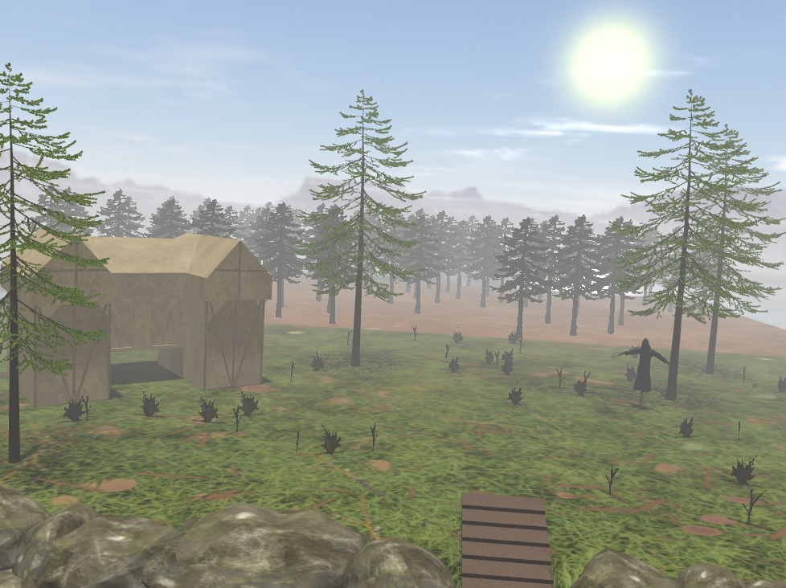

# OpenGL Project

This project is an interactive 3D scene built using **OpenGL** and **Blender**. It features various lighting effects, animations, and environmental controls. Below is a detailed description of the keyboard controls and features available in the project.

---

## Keyboard Controls

| Key | Action |
|-----|--------|
| **W** | Move the camera forward. |
| **S** | Move the camera backward. |
| **A** | Move the camera to the left. |
| **D** | Move the camera to the right. |
| **M** | Toggle the shadow map visualization. |
| **N** | Activate the scarecrow animation, causing it to rotate around itself. |
| **P** | Enable the point light and switch to a night environment. |
| **Q** | Toggle the directional light on and off. |
| **L** | Move the directional light forward. |
| **J** | Move the directional light backward. |
| **R** | Start the snow effect. |
| **T** | Begin an automated tour of the scene. |

---

## Features

### Shadow Map Visualization
- Press **M** to toggle the shadow map visualization. This allows you to see how shadows are being rendered in the scene.

### Scarecrow Animation
- Press **N** to activate the scarecrow animation. The scarecrow will rotate around itself, adding a dynamic element to the scene.

### Point Light and Night Environment
- Press **P** to enable the point light and switch to a night environment. This changes the lighting and ambiance of the scene to simulate nighttime.

### Directional Light Control
- Press **Q** to toggle the directional light on and off. Use **L** and **J** to move the directional light forward and backward, respectively.

### Snow Effect
- Press **R** to start the snow effect. This adds a layer of falling snow to the scene, enhancing the winter atmosphere.

### Automated Scene Tour
- Press **T** to begin an automated tour of the scene. The camera will move through the scene, giving you a guided view of all the elements.

